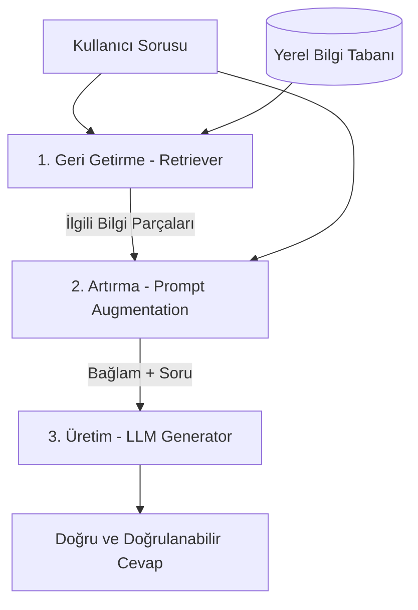

# Local RAG Assistant (Yerel RAG Asistanı)

Bu proje, **Microsoft Foundry Local** ve **RAG (Retrieval-Augmented Generation)** mimarisini kullanarak sıfır internet bağımlılığı ile (tamamen çevrimdışı/offline) çalışan yerel bir Soru-Cevap (Q&A) asistanıdır.

---

## 📅 Yol Haritası & İlerleme

### 🔹 Aşama 1: Temeller (Şu anki Aşama)
*   **1. Hafta (Week 1):** RAG Konsepti, Manuel Simülasyon, Geliştirme Ortamı Kurulumu ve Basit LLM Bağlantısı.
    *   [x] **Adım 1:** RAG Konseptinin Anlatımı ve Manuel Simülasyon (Tamamlandı)
    *   [ ] **Adım 2:** Geliştirme Ortamı ve Bağımlılıkların Kurulması (Sıradaki Adım)

---

## 📚 1. Hafta - Adım 1: RAG Konsepti ve Simülasyon Raporu

### 1. RAG Nedir ve Hangi Problemi Çözer?
Büyük Dil Modelleri (LLM), genel bilgilerde başarılı olsalar da belirli bir alana (domain-specific) veya özel şirket verilerine sahip değillerdir. Ayrıca bilmedikleri konularda mantıklı görünen ama tamamen uydurma cevaplar üretebilirler (**Halüsinasyon**).

**RAG (Retrieval-Augmented Generation - Geri Getirme Artırılmış Üretim)** bu problemi çözmek için 3 adımdan oluşan bir mimari sunar:
1.  **Geri Getirme (Retrieve):** Kullanıcının sorusuyla alakalı bilgileri yerel bilgi tabanından (PDF, txt, veri tabanı vb.) çeker.
2.  **Artırma (Augment):** Çekilen bu bilgileri (bağlam/context) ve kullanıcının sorusunu birleştirerek zengin bir prompt oluşturur.
3.  **Üretme (Generate):** LLM'e sadece bu bağlama sadık kalarak cevap üretmesini söyler. Böylece halüsinasyonlar engellenir.

---

### 🎭 Manuel RAG Simülasyon Testi
Sistemi kodlamadan önce mantığını kavramak amacıyla hayali bir cihaz olan **"Lumina-X Akıllı Ev Kontrol Paneli"** kılavuzu üzerinden bir simülasyon gerçekleştirdik.

#### Kullanılan Bilgi Tabanı:
*   **Hata Kodu 102 (Mavi Işık Yanıp Sönüyor):** Wi-Fi bağlantısı kopuktur. Çözüm için arkadaki "Reset" butonuna 5 saniye basılı tutun.
*   **Hata Kodu 404 (Kırmızı Işık Sabit):** Dahili depolama hatasıdır. MicroSD kartı çıkarıp takın ve güç tuşuna 10 saniye basılı tutarak açın.
*   *Kılavuzda 103 hata koduna dair hiçbir bilgi bulunmamaktadır.*

#### Simüle Edilen Test Durumu (Halüsinasyon Engelleme Testi):
*   **Kullanıcı Sorusu:** *"Ekranda mavi ışık yanıyor ve 103 hatası alıyorum."*
*   **Retriever Sonucu:** Boş (Kılavuzda 103 hata koduna dair bilgi bulunamadı).
*   **LLM Çıktısı (Uydurmadan):** *"Lumina-X Kullanım Kılavuzu'nda 103 hata koduna ve bu durumda ne yapılacağına dair bir bilgi bulunmamaktadır. Lütfen hata kodunu tekrar kontrol edin..."*

RAG mimarisinin bilgi uydurmayı nasıl engellediği bu manuel test ile doğrulanmıştır.
